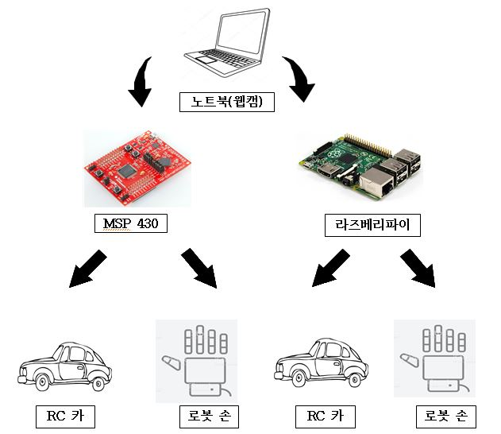
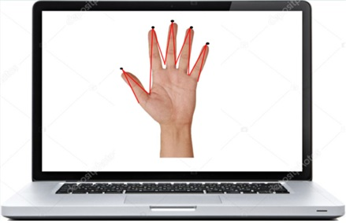
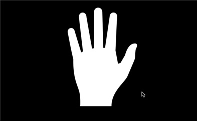
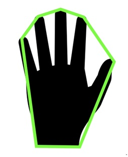
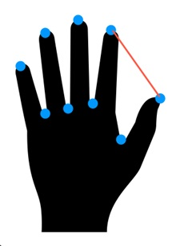
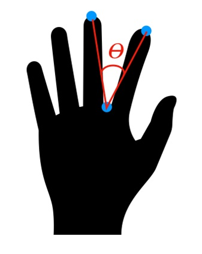
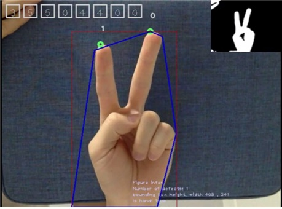

# FingerRobot
Robots that follow the shape of a human hand

### 전체 동작 요약

- 노트북의 웹캠에 보여지는 화면을 분석하고 그 데이터를 MCU에 블루투스 통신으로 데이터를 전달하여

  MCU에서 그 데이터 값으로 각 핀의 입력을 조절하여 RC카와 로봇 손을 조절하게된다.

### 실시간 손동작 인식 알고리즘

1. 동작 기초 설명 

실시간 화면 인식은 노트북에 내장되어 있는 웹캠에 전송되는 화면에 도형(손)을 인식하는 것으로 화면에 도형(손)을 분석하여 각 손의 최대 점을 꼭지 점으로 잡아서 각 꼭지 점들이 이루는 각을 분석하여 둘 사이 각이 일정각도 이상이 될 때 그 점들을 개수로 읽어내 데이터를 분석하는 방법을 택했다.

  

   2. 동작 알고리즘     

      - 1단계 – 카메라를 통해 손의 색을 추출하여 아래 사진과 같이 이진화(흑,백으로) 한다.

        

      - 2단계 – 실시간 영상을 인식해야 하기 때문에 손 전체를 따라 다니는 것은 효율적이지 않다. 따라서, 폐곡선인 손의 모양을 다각화 시킨다. 이렇게 만든 다각형의 꼭지점만을 저장하여 그 꼭지점을 이용하여 움직이는 손을 추적한다.

        

      - 3단계 – 폐곡선(손)읜 끝점(꼭지점)의 좌표와 각 꼭지점 중 인접한 두 꼭지점을 이은 선분과 가장 멀리 떨어져 있는 폐곡선 위의 한점의 좌표를 반환하는 함수를 실행한다. 즉 각각의 손가락 끝의 좌표와 손가락 사아l의 점의 좌표를 구할 수 있다.

        

      - 4단계 -     값이 0도와 95도 사이일 경우 카운팅 한다. 

        

      - 5단계 – 3단계와 4단계의 과정을 손가락 개수만큼 반복 실행한다.

​     

​     

3. 시연 사진

     

​     

